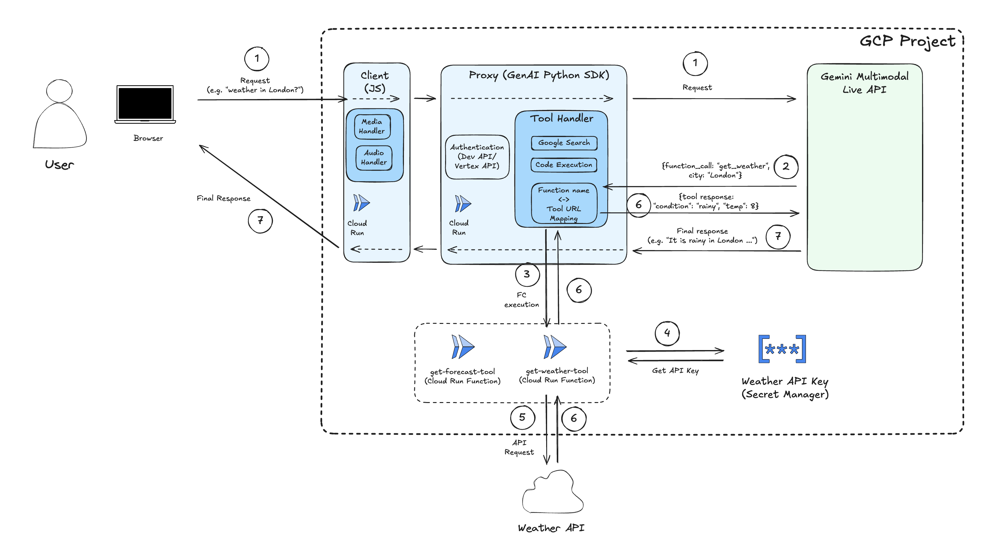

# Live API Demo

**與 AI 進行前所未有的即時對話！本應用展示了 Gemini Flash Live API 的強大多模態能力。**

體驗如同「星際爭霸戰電腦」般的互動方式 — 自然語音交流、網路攝影機分享、螢幕共享，並獲得即時的串流音訊回應。這個應用將未來科技體驗帶到您的設備上。

本專案基於 [Heiko Hotz](https://github.com/heiko-hotz) 的 [Project Livewire](https://github.com/heiko-hotz/project-livewire) 開發，專注於更穩定的設定和增強功能。

## ✨ 主要功能

*   **🎤 即時語音對話**：自然、低延遲的語音交流
*   **👁️ 多模態輸入**：結合語音、文字、網路攝影機和螢幕分享
*   **🔊 串流音訊輸出**：即時聽到 AI 生成的回應
*   **↩️ 可中斷對話**：可在 AI 回應時進行打斷，如真實對話
*   **🔍 Google 搜尋整合**：獲取即時資訊
*   **📱 響應式介面**：包含桌面版和行動版優化介面
*   **📝 即時轉錄**：顯示輸入和輸出的語音轉錄

<!-- Optional: Add a GIF/Video Demo Here -->
<!--  -->

## 🚀 快速開始

**前置需求：**

*   Python 3.8+
*   Google Gemini API 金鑰 ([申請連結](https://makersuite.google.com/app/apikey))

---

### 1. 💻 本地運行

以下是基本步驟。詳細說明請參考 **[本地設定指南](./docs/local_setup.md)**。

1.  **設定後端：**
    ```bash
    cd server
    echo "GOOGLE_API_KEY=your_api_key_here" > .env
    ```

2.  **啟動後端：**
    ```bash
    pip install -r requirements.txt
    python server.py
    # 後端運行於 localhost:8081
    ```

3.  **啟動前端（新終端）：**
    ```bash
    cd ../client
    python -m http.server 8000
    # 前端運行於 localhost:8000
    ```

4.  **存取介面：**
    *   桌面版：`http://localhost:8000/index.html`
    *   行動版：`http://localhost:8000/mobile.html`


## 🏗️ 架構概覽

Live API Demo 包含：

1.  **客戶端 (`client/`)**：使用 Vanilla JS 的前端，處理 UI、媒體捕獲和 WebSocket 連接
2.  **伺服器 (`server/`)**：Python WebSocket 伺服器，代理 Gemini API 並管理會話
3.  **Gemini API**：透過 Live API 存取 Google 的多模態 AI 模型，整合 Google 搜尋功能


*(使用者 -> 客戶端 -> 伺服器 -> Gemini API (含 Google 搜尋) -> 伺服器 -> 客戶端 -> 使用者)*
- 本專案與原始修改調整為純 Local Setup
- 將 Cloud Function Tool Use 改成 Google Search
- 增加語音生成時逐字稿呈現的功能

## ❓ 故障排除

*   檢查終端輸出的錯誤訊息。確保 `.env` 檔案中的 `GOOGLE_API_KEY` 正確
*   查閱 [本地設定指南](./docs/local_setup.md) 獲取詳細設定說明
*   確認瀏覽器支援 WebSocket 和 Web Audio API
*   檢查防火牆設定是否阻擋 port 8081 (後端) 和 8000 (前端)

## 📜 授權

本專案採用 Apache License 2.0 授權。詳見 [LICENSE](./LICENSE) 檔案。

## 🤝 貢獻與免責聲明

本專案基於 [Heiko Hotz](https://github.com/heiko-hotz) 的原始 Project Livewire 開發，用於探索 Gemini 功能。歡迎透過 Issues 或 Pull Requests 提出建議和意見回饋。

**⚠️ 使用聲明：**
- 本專案僅供教學和演示用途，不得用於商業目的
- 本專案為獨立開發，不代表 Google 或其他公司的觀點或立場
- 根據 Apache 2.0 授權，軟體按「現狀」提供，無任何擔保
